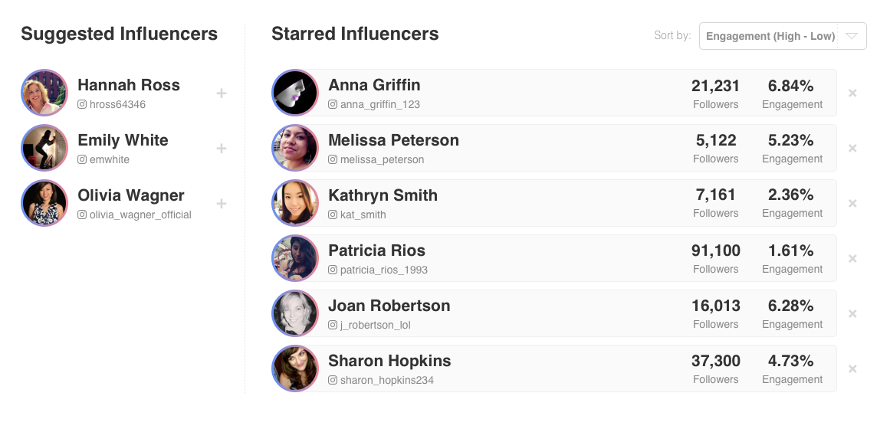

# Model Village Coding Test: Back-End Engineer

I'm not particularly happy with how I have done this test.

My initial approach was to use a Rails framework and get and manipulate the data using purely controller options.
However, this did not work well as I had to introduce a way to reload the page (eventually by redirecting to itself) every time the data changed.
I ran into a big roadblock when coming to sort the list of starred influencers as I had to introduce javascript to do so, but I had not written code in a way which was conducive to that.

I eventually scrapped what I had done.

My second attempt is this one, using a Sinatra backend with AngularJS on the front end. I appreciate that this was asked to be a Ruby application but I could not find another way to do what was asked.

The Sinatra backend returns a json of the database (that is the only action it does), and the Angular on the front end takes care of manipulating it (sorting, moving to different lists).

To run this:
```
git clone git@github.com:sivanpatel/model_influencers.git
cd model_influencers
bundle install
rake db:create
rake db:migrate
rake db:seed
rackup
```

Then visit `localhost:9292`

**Please upload this project to your preferred source control platform and share with Model Village. Place your work inside the `/test` folder**

We’d like to see how you approach this challenge, and what process you take, so please aim to push regular commits to the repository as you work through the task.



For this coding test, we’d like you to build out the above interface as a Ruby  application.

The app should allow a user to view their list of ‘Starred’ influencers. This list should be sortable, and it should be possible to remove a user from the list.

The app should also show a list of suggested influencers. Clicking on these users should add them to the starred influencer list.

You should:

* Use Rails or Sinatra framework.
* Use the example_data or design a MySQL database schema of your own.
* Allow the user to sort the list.
* Stick to the above design as much as possible.
